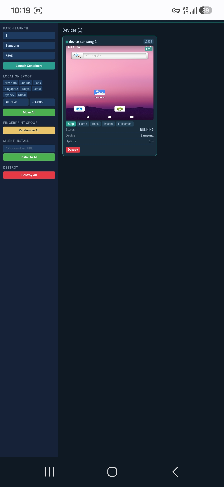
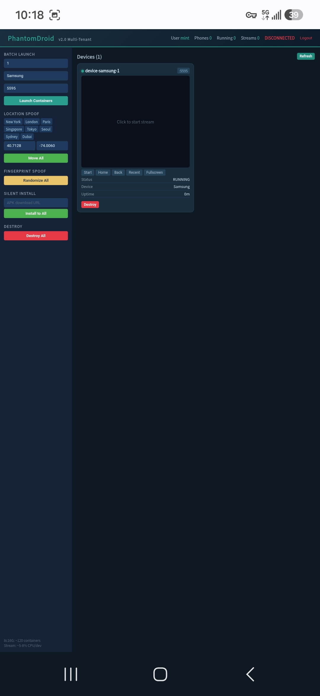
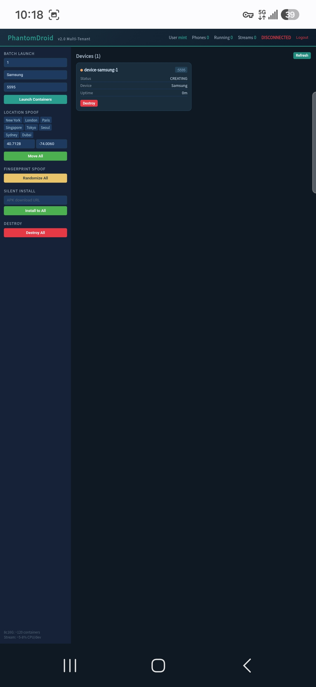
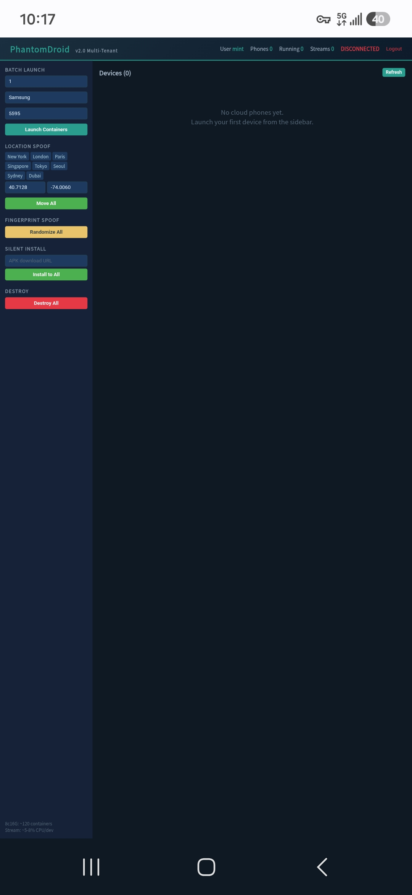

# PhantomDroid Java SaaS

**Enterprise Android Cloud Phone Orchestration Platform**


---

## Screenshots

| Overview & Batch Launch | Device Dashboard |
|:---:|:---:|
|  |  |

| Live Streaming & Controls | Location Spoofing |
|:---:|:---:|
|  |  |

---

## Features

### Core Capabilities

| Feature | Description |
|---------|-------------|
| **Batch Launch** | Create 1-50+ Redroid containers in one request |
| **Live Streaming** | 2fps screencap via WebSocket with touch/key injection |
| **GPS Spoofing** | One-click teleport to NYC, London, Tokyo, or custom coordinates |
| **Fingerprint Spoof** | Randomize device brand, model, IMEI, Android ID |
| **Silent APK Install** | Download URL → adb install -r (no manual steps) |
| **Idle Auto-Reap** | Configurable TTL, auto-destroy idle containers |

### Security & Multi-Tenancy

| Feature | Description |
|---------|-------------|
| **No External DB** | Single `phantom.db` file — no MySQL, PostgreSQL, or Redis |
| **Lightweight JWT** | Pure Servlet Filter — zero Spring Security dependencies |
| **BCrypt Passwords** | Irreversible hash, never stored in plaintext |
| **Multi-Tenant Isolation** | Every device locked to its creating user |
| **Cross-User Blocking** | HTTP 403 on any cross-user access attempt |
| **WebSocket Auth** | JWT token in connection URL, ownership verified per command |

### Performance

| Metric | Value |
|--------|-------|
| Max containers (8c16G) | ~120 (1c/1.5G each) |
| Auth layer RAM | ~5 MB |
| CPU overhead | <1% per authenticated request |
| Startup time | ~7 seconds |
| DB latency | <5ms (SQLite WAL mode) |

---

## Quick Start

### Prerequisites

```
Java 21+      java -version
Docker        docker pull redroid/redroid:11.0.0-latest
ADB           adb --version
Maven         mvn --version
```

### Build & Run

```bash
git clone git@github.com:taomingyaojing/PhantomDroid-Java-SaaS.git
cd PhantomDroid-Java-SaaS
mvn clean package -DskipTests
java -jar target/phantomdroid-saas.jar
# Open http://localhost:8000
```

### First-Time Setup

1. Open `http://localhost:8000` — you'll see the **Login** overlay
2. Click **REGISTER**, enter username + password
3. The first user is automatically promoted to **ADMIN**
4. Login, then launch containers from the sidebar

---

## API Reference

### Authentication (no token needed)

```
POST /api/auth/register   { "username": "admin", "password": "***" }
  → { "code": 200, "data": { "token": "***", "userId": 1, "role": "ADMIN" } }

POST /api/auth/login      { "username": "admin", "password": "***" }
  → { "code": 200, "data": { "token": "***", "userId": 1, "role": "ADMIN" } }
```

### Device Management (requires `Authorization: Bearer <token>`)

| Method | Path | Description |
|--------|------|-------------|
| GET | `/api/device/list` | List current user's devices |
| GET | `/api/device/status` | Server status (scoped) |
| POST | `/api/device/launch` | Batch launch containers |
| POST | `/api/device/modify` | GPS / fingerprint spoof |
| POST | `/api/device/install-app` | Silent APK install |
| POST | `/api/device/start-stream/{port}` | Start scrcpy stream |
| POST | `/api/device/stop-stream/{port}` | Stop scrcpy stream |
| DELETE | `/api/device/{port}` | Destroy single container |
| DELETE | `/api/device/destroy-all` | Destroy all (current user) |

### WebSocket

```
ws://host:8000/ws/devices?token=<JWT>
```

- Binary frames for touch/key injection
- Text frames for screencap streaming (~2fps base64 PNG)
- Heartbeat broadcast (device status every 5s)

### Error Codes

| Code | Meaning |
|:----:|---------|
| 200 | Success |
| 400 | Validation failed |
| 401 | Token missing / expired / invalid |
| 403 | Cross-user access denied |
| 409 | Username already exists |
| 500 | Internal server error |

---

## License

MIT

---

*Built with by the PhantomDroid Team · [Report Bug](https://github.com/taomingyaojing/PhantomDroid-Java-SaaS/issues)*
